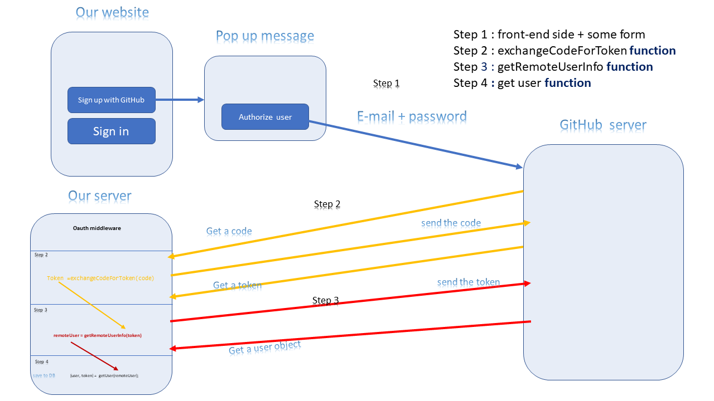

# auth-server

In this, the second phase of the Authentication Server build, we’ll be adding support for OAuth to the authentication server. Because the vast majority of our users are developers, we will be using GitHub as our OAuth provider.

### Author: Osama Mousa
### Links and Resources

- [submission PR class-12](https://github.com/401-advanced-javascript-osama/api-server/pull/8)

### Modules
#### `Node.js` 
### Packages
#### `express` , `bcryptjs` , `dotenv` , `jsonwebtoken` , `mongoose` , `morgan` 

#### How to initialize/run your application

- click the link on the html page 

#### Tests

- check mongoose database to see the record

#### UML

