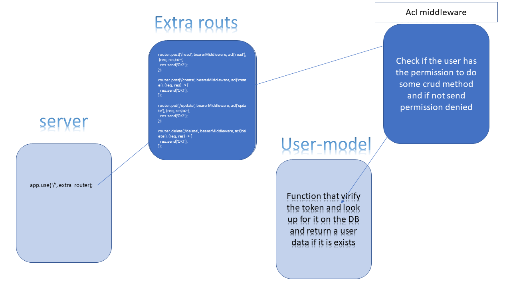

# auth-server

n this phase, the new requirement is that any user with a valid token (retrieved from either Basic Authentication or OAuth) is able to use that token to login to the system and potentially access protected routes

### Author: Osama Mousa
### Links and Resources

- [submission PR class-12](https://github.com/401-advanced-javascript-osama/auth-server/pull/4)

### Modules
#### `Node.js` 
### Packages
#### `express` , `bcryptjs` , `dotenv` , `jsonwebtoken` , `mongoose` , `morgan` 

#### How to initialize/run your application

- sign up then copy the token after that chose the bearer authorization from the header and past it thier then send you will get the user info
- after sign in copy the token and set it to the header `bearer authrization` and hit these routs :
    - http://localhost:3000/create
    - http://localhost:3000/update
    - http://localhost:3000/delete
    - http://localhost:3000/read

#### Tests

- check mongoose database to see the record

#### UML

